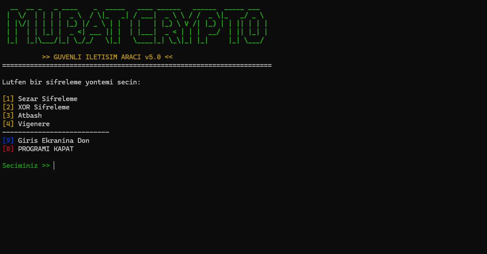

# 🔐 Crypto Tool v5.0

> **C++ ile geliştirilmiş, terminal tabanlı, gelişmiş şifreleme ve veri güvenliği aracı.**


## 📖 Proje Hakkında

**Murat Crypto Tool**, siber güvenlik ve algoritma mantığı üzerine odaklanarak geliştirilmiş bir eğitim projesidir. Kullanıcı dostu arayüzü ve hiyerarşik menü yapısı ile metinleri farklı algoritmalar kullanarak şifreleyebilir ve çözebilir.

Bu proje, veri yapıları ve güvenliği konularını pekiştirmek amacıyla geliştirilmiştir.



## 🚀 Özellikler

Bu araç aşağıdaki şifreleme yöntemlerini destekler:

* 🛡️ **Sezar Şifrelemesi (Caesar Cipher):** Alfabedeki harfleri belirli bir sayı kadar kaydırarak şifreler.
* 🧬 **XOR Şifrelemesi:** Metni bit düzeyinde (bitwise) işleyerek yüksek güvenlikli gizleme sağlar.
* 🔄 **Atbash Algoritması:** Alfabeyi tersine çevirerek (A -> Z, B -> Y) şifreleme yapar.
* 🔑 **Vigenère Şifrelemesi:** Sabit bir sayı yerine "Anahtar Kelime" kullanarak kırılması zor şifreler oluşturur.

### Diğer Teknik Özellikler
*    **Renkli Arayüz:** Kullanıcı deneyimini artırmak için ANSI renk kodları kullanılmıştır.
*    **Navigasyon Sistemi:** Menüler arası geçiş ve güvenli çıkış seçenekleri.
*    **Temiz Kod:** Fonksiyonel programlama prensiplerine uygun modüler yapı.

## 🛠️ Kurulum ve Çalıştırma

Bu projeyi bilgisayarınızda çalıştırmak için aşağıdaki adımları izleyebilirsiniz:

1.  **Depoyu Klonlayın:**
    ```bash
    git clone https://github.com/Omer-Murat/Murat-Crypto-Tool.git
    cd Murat-Crypto-Tool
    ```
 Geliştirici: Ömer Murat

---
*Bu proje açık kaynaklıdır ve eğitim amaçlı geliştirilmiştir.*
